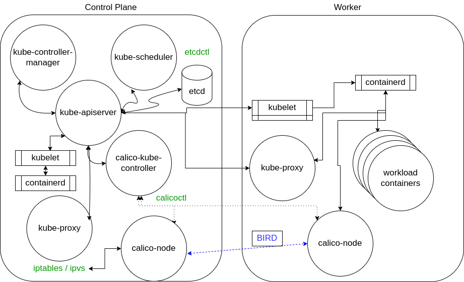

# Control plane node

Run *kubelet* and *kube-proxy*

*cloud-controller-manager* - interacts with tooling such as Rancher, etc

*kube-apiserver*; Only connection to the etcd database. It validates and configures data for API objects and services REST operations.

*kube-scheduler*: Uses an algorithm to determine which node whill host a Pod. Built-in retry mechanism. Checks available resources to bind.

Details of the scheduler:

[https://raw.githubusercontent.com/kubernetes/kubernetes/master/pkg/scheduler/scheduler.go](https://raw.githubusercontent.com/kubernetes/kubernetes/master/pkg/scheduler/scheduler.go)

*etcd database*: Persistent data of the Kube cluster; `etcdctl` allows for `snaphot save` and `snapshot restore`

*kube-controller-manager*: core control loop daemon which interacts with the kube-apiserver to determine the stat of the cluster.

# Worker nodes

Run *kubelet* and *kube-proxy*

*kubelet* managed by systemd and will start every pod found in `/etc/kubernetes/manfiests`. Does the following:

- Uses PodSpec
- Mounts volumes to Pod
- Downloads secrets
- Passes request to local container engine
- Reports status of Pods and node to cluster.

# Operator

The Informer which uses the API server as a source requests the state of an object via an API call. The data is cached to minimize API server transactions. A similar agent is the SharedInformer; objects are often used by multiple other objects. It creates a shared cache of the state for multiple requests.

A Workqueue uses a key to hand out tasks to various workers. The standard Go work queues of rate limiting, delayed, and time queue are typically used. 

The endpoints, namespace, and serviceaccounts operators each manage the eponymous resources for Pods. Deployments manage replicaSets, which manage Pods running the same podSpec, or replicas.

# Networking

Interesting slides:

[https://speakerdeck.com/thockin/illustrated-guide-to-kubernetes-networking](https://speakerdeck.com/thockin/illustrated-guide-to-kubernetes-networking)